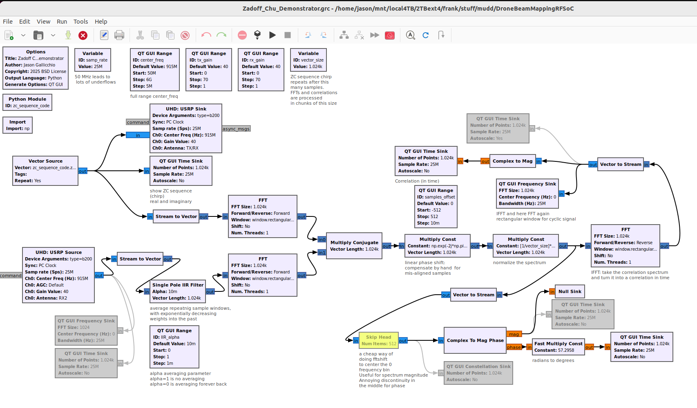

# DroneBeamMappingRFSoC

Wide-Band Antenna Pattern Mapping with an RFSoC on a Drone

A drone with a wide-band RFSoC-based transmitter and an RFSoC-based receiver to map the antenna pattern of a radio telescope

From Physics Professor [Jason Gallicchio](https://www.hmc.edu/physics/faculty-staff/gallicchio/)'s Harvey Mudd Research Group

## Abstract / Summary / Introduction

We designed and tested a drone with a wide-band transmitter (down to 30 MHz up to to 1.8 GHz) to measure the complex antenna pattern of radio telescopes. We basically split a VNA in half and flew one half on a drone. Radio telescopes at sub GHz frequencies are often not mechanically steerable. They are composed of arrays of dipoles, troughs, or dishes "pointing up". This makes it challenging to know the antenna pattern of each feed when ground and mechanical conditions cannot perfectly be simulated. The far sidelobes are especially challenging to measure, but must be known accurately to measure highly-redshifted hydrogen. Often such telescopes (e.g. CHIME) are used as an interferometer, with a fixed number of channels (e.g. 1024) across their bandwidth (e.g. 400-800 MHz) leading to a fixed FFT repeating time window (e.g. 2.56 µs). This gets accumulated some number of times (e.g. 2^14) and then dumped at some manageable rate (e.g. every 41.94304 ms).

Using a Xilinx RFSoC 4x2 board on a drone, we generate a chirp, sampled at 4 GSPS, which spans exactly this bandwidth and repeats at exactly this FFT time window. This allows us to use the existing correlation infrastructure to measure both the magnitude *and phase* of the antenna response in each spectral bin and in every direction as the drone flies a spiral hemisphere pattern. Because our repeating transmissions and reception window are synchronized, we can average noise and interference in either the time or frequency domain. Anything that's not exactly synchronized will average down. Our simple receiver Verilog averages in the time domain and we then do the Fourier and correlation stuff later in python.

In the development phase, we measured the beam pattern of a dual-polarized 1-meter parabolic dish. This required us to implement our own 2-input RFSoC receiver in Verilog and python, with flexibility to mimic the bandwidth, number of spectral channels, and repeating time window of many sub 2 GHz radio telescopes that are deployed or planned.

Our portable, pretend radio telescope for on-campus testing:

## GNURadio Prototype

The GNURadio prototype is [Zadoff_Chu_Demonstrator.grc](./Zadoff_Chu_Demonstrator.grc) and includes a simple embedded python function definition to generate the optimally-sampled chirp: a [Zadoff Chu Sequence](https://en.wikipedia.org/wiki/Zadoff%E2%80%93Chu_sequence) at startup.

The GNURadio prototype, by default, runs on a USRP B210 at a complex sample rate of 25 MSPS and therefore a bandwidth of 25 MHz, centered around 915 MHz (adjustable with a slider).  compare this to the RFSoC bandwidth of 2 GHz --- a factor of 80 wider. The signal processing math is otherwise nearly identical.

The GNURadio prototype only took an hour or two to make, but demonstrates:
* You can see the correlation go down as you move the antennas farther away and make the polarization of the antennas less parallel.
* You can see the phase change when you move the antennas *even a fraction of a centimeter* closer or farther away (for a 30 cm wavelength).
* You move a slider to change the central frequency to operate at the edge of the bandpass filter and see the sharp cutoff in the cross spectrum.
* I even do a version of the RFSoC's accumulate and dump in the time domain, though in the GNU Radio prototype, it's really an IIR filter with a slider as a parameter that, by default, averages around the last 100 capture windows with exponentially-falling weights in the past.

Unfortunately, there are challenges with the hardware:
* The DC compensation screws up the spectrum around the carrier. The rolloff near the edges makes that response not ideal. I should only transmit well within either the upper or lower half of the B210's band.
* Every time I get an underrun, the offset between transmit and receive resets to some arbitrary number of samples. I can manually "tune it out" each time this happens, but maybe I should set the sample rate much slower to avoid underruns at the cost of a narrower bandwidth for the "through VNA".

## Overview of FPGA Verilog and Python

Both the transmitter and receiver use the same FPGA image from the same PYNQ-based microSD card image, each running on an RFSoC 4x2 board. One board with this same firmware can be used for both transmit and receive for testing in the lab without the hassle of GPSDO synchronization.

My starting point was RFSoC-MTS <https://github.com/Xilinx/RFSoC-MTS>, the RFSOC-PYNQ Multi-Tile Synchronization Overlay running on the RFSoC4x2. Yes, it synchronizes the tiles, but it also is a simple project which comes ready to:
* write samples to 2 FPGA RAMs (one for each DAC) as if they were 2 int16 numpy arrays, then
* trigger repeated transmits, squirting the samples out of the 2 DACs at 4 GSPS with no gaps, while
* capturing samples from up to 3 ADCs into 2 FPGA RAMs that are later accessed as 3 int16 arrays. Why 3? The MTS example has 3 and we have not changed it.

I made the following changes:
* We don't want to output or capture the entire "power of 2 sized" array. Instead, you can write to a new GPIO address `nSamples` in python, which will cause the output to repeat after fewer samples. It must remain a multiple of 16 because the DACs are fed in parallel in groups of 16 samples. This is convenient for making frequencies rounded to powers of 10 (like 10.000000 MHz), rather than only powers of 2. This one change is all that is needed for the transmitter, and it can be implimented entirely by editing the block diagram in Vivado.
* For the receiver, I don't do any channelization or cross correlation or FFTs in Verilog. Instead, I implemented a simple [AccumulateAndDump.v](AccumulateAndDump.v) Verilog block in the time domain. For each ADC, it is an int32 array at least `nSamples` long that gets filled up to the number of samples specified (again a multiple of 16, often lasting a few µs), after which the next `nSamples` get added to the first group. The process repeats `nAccumulate` times (often lasting 1-100 ms). Then the whole array gets dumped to a python-visible memory location to be read out as an int32 array while the next sample starts the following accumulation cycle, all *without gaps*. There is a dump counter, overflow flags, and other flags to let python know if it was too slow and missed a dump.

The python also started with the RFSoC-MTS example notebook [rfsocMTS.ipynb](https://github.com/Xilinx/RFSoC-MTS/blob/main/boards/RFSoC4x2/notebooks/rfsocMTS.ipynb) with additions for my verilog modifications above, along with generation of the custom chirp --- specifically a [Zadoff-Chu (ZC) sequence](https://en.wikipedia.org/wiki/Zadoff%E2%80%93Chu_sequence) --- and FFT processing of the accumulated dump.

When used to take data on a drone, the series of accumulated dumps are stored with timestamps for later combination with the logs from the PX4 flight control software.

The RFSoC can by synchronized to an external 10 MHz reference from a GPSDO. We are planning on starting the transmission and the accumulation on a 1 PPS hardware transition.

## Drone Platform and Parameter Configuration

Our platform is a [Tarot X6 Hexacopter](https://www.foxtechfpv.com/tarot-x6-hexacopter-frame-p-1945.html) with a [Cube Orange](https://docs.px4.io/main/en/flight_controller/cubepilot_cube_orange.html) running [PX4](https://docs.px4.io/). We get accurate yaw orientation from dual [SparkFun uBlox ZED-F9P](https://www.sparkfun.com/sparkfun-gps-rtk-sma-breakout-zed-f9p-qwiic.html) units.

Our custom payload includes an [RFSoC 4x2](https://www.realdigital.org/hardware/rfsoc-4x2) board, a [Aaronia BicoLOG 30100](https://aaronia.com/en/emv-antenne-bicolog-30100) antenna, a [Leo Bodnar LBE-1421 GPSDO](https://www.leobodnar.com/shop/index.php?main_page=product_info&products_id=399), and various RF filters and amplifiers.

## Drone flight path planning

## Beam Mapping Analysis Notebook

# Notes

### Example Radio Telescopes

* CHIME 400–800 MHz  red-shifted hydrogen, pulsars, fast radio bursts.
* CHORD 300-1500 MHz 
* HERA 50–200 MHz
* HIRAX 400–800 MHz
* MWA 70–300 MHz 256 array of 16-element dual-polarisation
* LOFAR 10–240 MHz array of dipole antennas at 1.25 to 30m
* PAPER 100–200 MHz Thirty-two crossed-dipole

